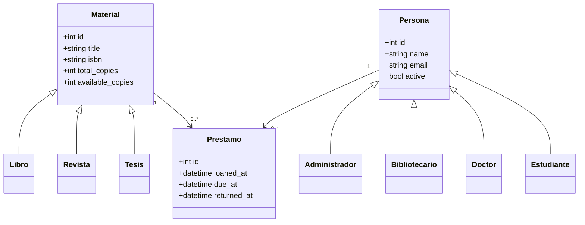

# Diagrama de clases

## Tablas

- `material`: tabla base con discriminador `tipo_material`.
- `persona`: tabla base con discriminador `tipo_persona`.
- `prestamo`: relaciona `material_id` y `persona_id`, y conserva el historial de devoluciones.

La herencia usa el patrón single-table inheritance de SQLAlchemy: las subclases comparten la tabla de su clase base y el discriminador identifica el tipo concreto.
