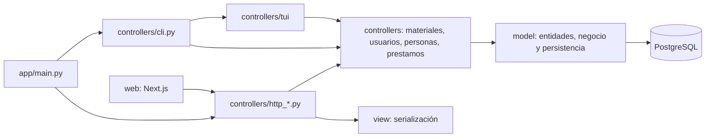

# Arquitectura MVC

`app/main.py` crea Flask, configura SQLAlchemy, CORS y registra los controladores.
`app/__init__.py` solo reexporta la factoría por compatibilidad.
No hay `extensions.py`, `settings/` ni carpeta `api/`.

## Backend

- Modelo: herencia de tabla única para Material (Libro, Revista, Tesis) y Persona
  (Administrador, Bibliotecario, Docente, Estudiante). Prestamo conserva el historial.
- `catalogo.py` prepara consultas; `reportes.py` prepara reportes.
- `controllers/materiales.py`, `usuarios.py`, `personas.py` y `prestamos.py`
  coordinan las gestiones compartidas por HTTP, CLI y TUI.
- `model/material.py`, `persona.py` y `prestamo.py` encapsulan entidades,
  validaciones, consultas y operaciones transaccionales como métodos del modelo.
- `transaction.py` centraliza commit/rollback. Los préstamos bloquean filas en
  PostgreSQL para proteger disponibilidad y devoluciones concurrentes.
- Controladores HTTP: `http_auth`, `http_materials`, `http_users`, `http_readers`, `http_loans`,
  `http_reports`; `http_security` valida sesión y rol; `http_guards` protege CSRF.
- Vista: `consola.py` presenta tablas; `serializers.py` expone datos sin hashes.
- CLI y TUI invocan los mismos servicios; no requieren login.

## Frontend

`web/` es un proyecto independiente al lado de `app/`, dentro del repositorio.
`web/app` contiene las entradas que exige Next.js. Las responsabilidades propias
se distribuyen entre `model` (HTTP y contratos), `controllers` (carga) y `view`
(formularios, tablas y gestiones). No hay servidor de negocio duplicado en Next.js.

## Permisos HTTP

| Operación | Administrador | Bibliotecario | Docente / Estudiante |
|---|---|---|---|
| Consultar catálogo | Sí | Sí | Sí |
| Crear, editar, eliminar materiales | Sí | Sí | No |
| Consultar personas | Sí | Sí | No |
| Crear, editar, eliminar personas | Sí | No | No |
| Consultar préstamos | Todos | Todos | Propios |
| Prestar y devolver | Sí | Sí | No |
| Reportes | Sí | Sí | No |

El rol se asigna al crear una persona. La edición cambia nombre/correo, no la
clase de herencia. La edición de materiales cambia título/ISBN; las copias se
asignan al crearlos. No se destruye historial desde HTTP.

## Contrato HTTP `/api/v1`

- `GET /health`, `GET /auth/me` (usuario y token CSRF).
- `POST /auth/login`, `POST /auth/logout` con `X-CSRF-Token`.
- `GET/POST /materials`, `PATCH/DELETE /materials/:id`.
- `GET/POST /users`, `PATCH/DELETE /users/:id`. `GET /users?group=staff` filtra usuarios internos.
- `GET/POST /readers`, `PATCH/DELETE /readers/:id`: docentes y estudiantes.
- `GET/POST /loans`, `POST /loans/:id/return`.
- `GET /reports/{summary,inventory,users,readers,loans,overdue}`.

Sesiones firmadas, cookies HttpOnly/SameSite=Lax, hash scrypt, expiración de ocho
horas, token CSRF rotado al login, CORS explícito y límite de diez intentos de
login/minuto/IP. Gunicorn usa un proceso y cuatro threads; el limitador está en
memoria y se reinicia con el proceso. Para múltiples workers se necesita un
almacén compartido de límites. HTTPS y cookie Secure son obligatorios al publicar.

## Límites

130 líneas físicas por fuente propio, verificadas automáticamente. Los archivos
generados y lockfiles se excluyen. No introducir carpetas de capas adicionales.
Las pruebas unitarias usan SQLite; concurrencia real debe comprobarse en PostgreSQL.

## Gestiones y migración de roles

Las cuatro subclases de Persona son Administrador, Bibliotecario, Docente y
Estudiante. Los lectores son docentes y estudiantes; los usuarios internos son
administradores y bibliotecarios. No se duplican entidades ni tablas para separar
las gestiones. Prestamo referencia Persona y Material; Material admite únicamente
Libro, Revista y Tesis.

`init-db` convierte el discriminador histórico `doctor` a `docente`, preservando
ID, contraseña e historial. Agrega las columnas de identidad y biblioteca cuando
faltan en bases antiguas. La conversión es idempotente y también se ejecuta al
iniciar Flask. El rol retirado se rechaza al crear cuentas nuevas.

El reporte `users` incluye solo usuarios internos; `readers` incluye lectores.
El catálogo, préstamos y reportes se comparten entre CLI, TUI y HTTP mediante
controladores de gestión y métodos del modelo. `app/main.py` es dueño de la única instancia SQLAlchemy.

Next.js mantiene entradas pequeñas en `web/app`; las vistas viven en `web/view`.
Los hooks de `web/controllers` coordinan sesión, mutaciones, carga y reportes;
`web/model` contiene contratos y transporte HTTP, con timeout de 15 segundos.
El administrador gestiona usuarios y lectores en pantallas distintas. El
bibliotecario tiene acceso de consulta a ambas. Docentes y estudiantes consultan
sus propios préstamos; las solicitudes y devoluciones se tramitan con biblioteca.
Toda escritura HTTP exige Origin igual a WEB_ORIGIN y un token CSRF válido.

## Distribución de responsabilidades Python

| Responsabilidad | Ubicación |
|---|---|
| Crear, obtener, editar y eliminar materiales desde una gestión | `controllers/materiales.py` |
| Coordinar usuarios y autenticación | `controllers/usuarios.py` |
| Coordinar lectores docentes y estudiantes | `controllers/personas.py` |
| Coordinar préstamo, devolución y consulta | `controllers/prestamos.py` |
| Entidades, reglas, SQL y transacciones | Métodos de `model/material.py`, `persona.py` y `prestamo.py` |
| Consultas de catálogo y reportes | `model/catalogo.py` y `model/reportes.py` |
| Cabeceras y formato de tablas TUI | `view/management.py` |

Ejemplo: `http_materials` recibe el JSON y llama a
`controllers.materiales.create_material`; este delega en `Material.create`, que
valida el tipo y las copias, persiste y aplica commit/rollback mediante
`transactional`. La respuesta se presenta con `view.serializers.material_json`.
CLI y TUI reutilizan el mismo controlador de gestión.

Los cuatro módulos de gestión ya no existen en `app/model`. Los imports internos
usan `app.controllers`. Una función pertenece a una capa según su responsabilidad;
las consultas, validaciones y transacciones siguen formando parte del modelo.
Los controladores no ejecutan SQL ni administran directamente `db.session`.
