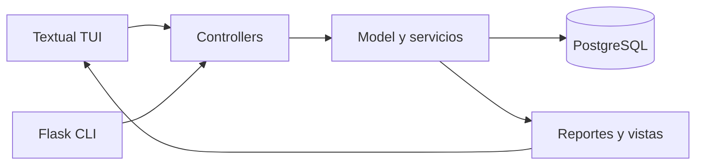

# Arquitectura

## Flujo principal

## Capas

### Model

`app/model/` contiene las entidades, relaciones, operaciones de dominio, reportes y datos de prueba. Esta capa conoce SQLAlchemy y la base de datos, pero no conoce Textual ni Click.

### Controllers

`app/controllers/` contiene adaptadores de entrada:

- `cli.py`: registra comandos y delega.
- `users.py`: CRUD de usuarios por rol.
- `readers.py`: CRUD de lectores.
- `materials.py`: CRUD de materiales.
- `loans.py`: préstamos y devoluciones.
- `reports.py`: reporte de consola.
- `tui/`: pantallas Textual separadas por responsabilidad.

Los controladores no deben implementar consultas o reglas de disponibilidad directamente.

### View

`app/view/` contiene formatos de tablas y salida reutilizable. El TUI usa sus propios widgets Textual, pero reutiliza consultas preparadas por el modelo.

### Settings

`main.py` es el orquestador: crea Flask, SQLAlchemy, CORS, CLI, TUI y API. `app/settings/config.py` lee `DATABASE_URL` y opciones de Flask desde el entorno. No colocar secretos en el código. `app/extensions.py` no forma parte de la arquitectura.

## Persistencia

La herencia se implementa con single-table inheritance:

- `material`: `Material` con `tipo_material`; subtipos `Libro`, `Revista`, `Tesis`.
- `persona`: `Persona` con `tipo_persona`; subtipos `Administrador`, `Bibliotecario`, `Doctor`, `Estudiante`.
- `prestamo`: enlaza un material con una persona y conserva fechas de préstamo, vencimiento y devolución.

## TUI

`LibraryTui` abre el menú principal. Cada gestión usa `ManagementScreen`; los formularios están en `FormScreen` y los reportes en `ReportScreen`. Las entidades existentes se eligen con combos Textual, no con IDs escritos a mano.
