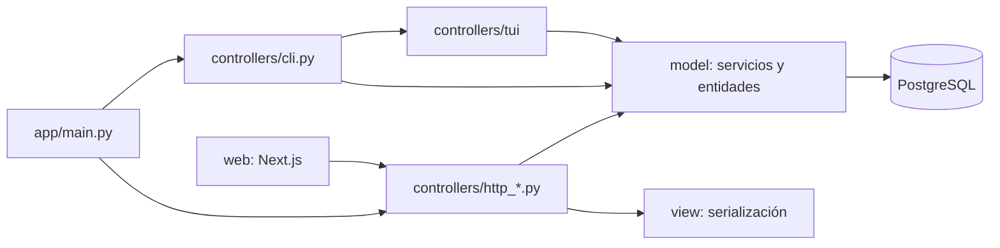

# Arquitectura MVC

`app/main.py` crea Flask, configura SQLAlchemy, CORS y registra los controladores.
`app/__init__.py` solo reexporta la factoría por compatibilidad.
No hay `extensions.py`, `settings/` ni carpeta `api/`.

## Backend

- Modelo: herencia de tabla única para Material (Libro, Revista, Tesis) y Persona
  (Administrador, Bibliotecario, Doctor, Estudiante). Prestamo conserva el historial.
- `catalogo.py` prepara consultas; `reportes.py` prepara reportes.
- `materiales.py`, `usuarios.py`, `personas.py` y `prestamos.py` implementan servicios.
- `transaction.py` centraliza commit/rollback. Los préstamos bloquean filas en
  PostgreSQL para proteger disponibilidad y devoluciones concurrentes.
- Controladores HTTP: `http_auth`, `http_materials`, `http_users`, `http_loans`,
  `http_reports`; `http_security` valida sesión y rol; `http_guards` protege CSRF.
- Vista: `consola.py` presenta tablas; `serializers.py` expone datos sin hashes.
- CLI y TUI invocan los mismos servicios; no requieren login.

## Frontend

`web/` es un proyecto independiente al lado de `app/`, dentro del repositorio.
`web/app` contiene las entradas que exige Next.js. Las responsabilidades propias
se distribuyen entre `model` (HTTP y contratos), `controllers` (carga) y `view`
(formularios, tablas y gestiones). No hay servidor de negocio duplicado en Next.js.

## Permisos HTTP

| Operación | Administrador | Bibliotecario | Doctor / Estudiante |
|---|---|---|---|
| Consultar catálogo | Sí | Sí | Sí |
| Crear, editar, eliminar materiales | Sí | Sí | No |
| Consultar personas | Sí | Sí | No |
| Crear, editar, eliminar personas | Sí | No | No |
| Consultar préstamos | Todos | Todos | Propios |
| Prestar y devolver | Sí | Sí | No |
| Reportes | Sí | Sí | No |

El rol se asigna al crear una persona. La edición cambia nombre/correo, no la
clase de herencia. La edición de materiales cambia título/ISBN; las copias se
asignan al crearlos. No se destruye historial desde HTTP.

## Contrato HTTP `/api/v1`

- `GET /health`, `GET /auth/me` (usuario y token CSRF).
- `POST /auth/login`, `POST /auth/logout` con `X-CSRF-Token`.
- `GET/POST /materials`, `PATCH/DELETE /materials/:id`.
- `GET/POST /users`, `PATCH/DELETE /users/:id`.
- `GET/POST /loans`, `POST /loans/:id/return`.
- `GET /reports/{summary,inventory,users,loans,overdue}`.

Sesiones firmadas, cookies HttpOnly/SameSite=Lax, hash scrypt, expiración de ocho
horas, token CSRF rotado al login, CORS explícito y límite de diez intentos de
login/minuto/IP. Gunicorn usa un proceso y cuatro threads; el limitador está en
memoria y se reinicia con el proceso. Para múltiples workers se necesita un
almacén compartido de límites. HTTPS y cookie Secure son obligatorios al publicar.

## Límites

130 líneas físicas por fuente propio, verificadas automáticamente. Los archivos
generados y lockfiles se excluyen. No introducir carpetas de capas adicionales.
Las pruebas unitarias usan SQLite; concurrencia real debe comprobarse en PostgreSQL.
