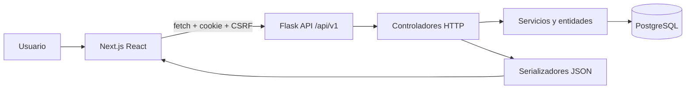
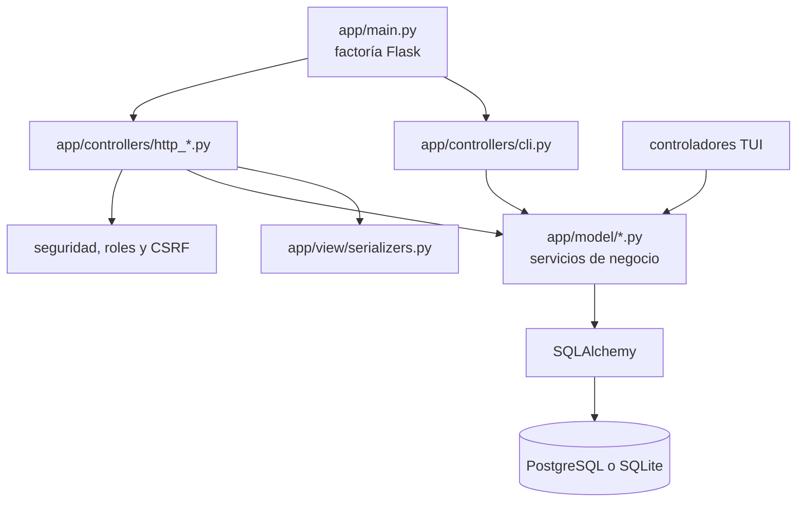
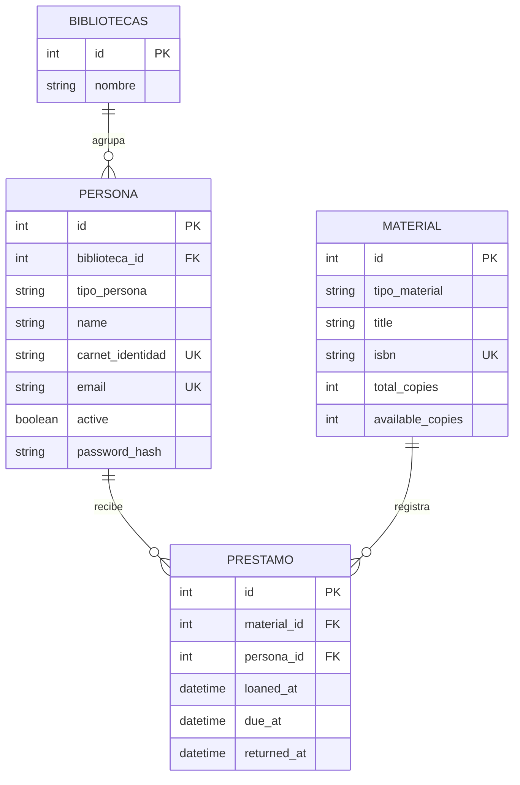
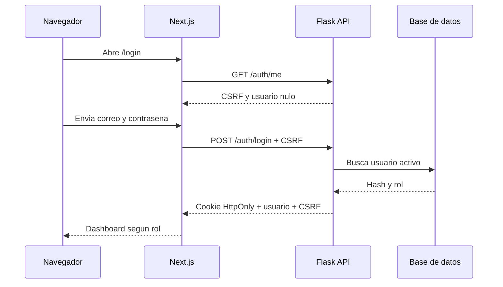
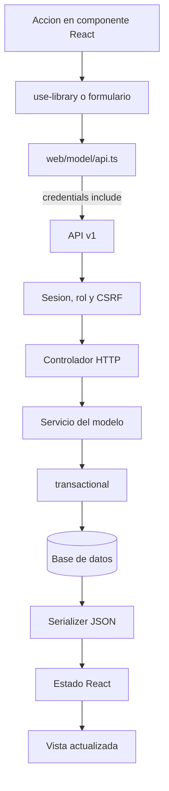
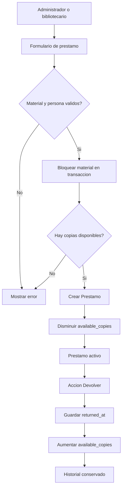
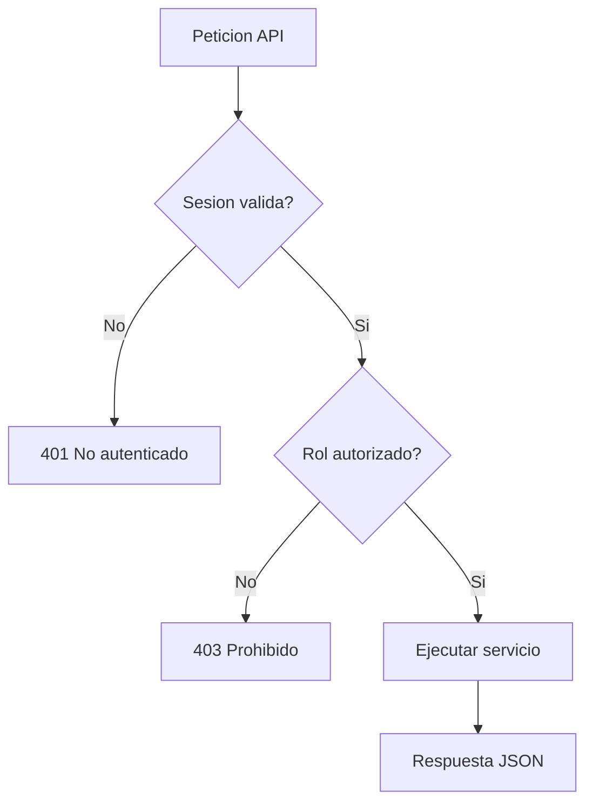
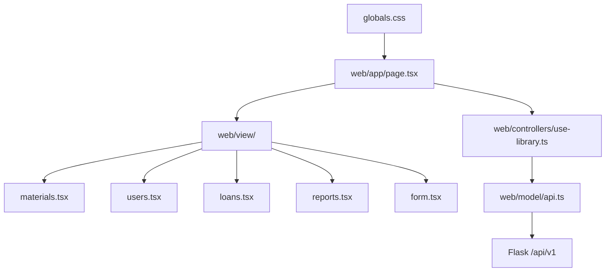
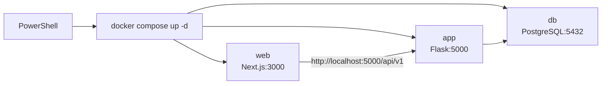

# Diagramas y flujos del sistema Biblioteca

**Fecha de documentacion:** 07/10/2026

Este documento describe la implementacion actual. Los diagramas usan Mermaid y
pueden visualizarse en GitHub, VS Code con una extension Mermaid o cualquier
visor compatible.

## 1. Arquitectura general



## 2. Estructura MVC del backend



## 3. Diagrama entidad-relacion



## 4. Flujo de autenticacion



## 5. Flujo de una solicitud web



## 6. Flujo de prestamos y devoluciones



## 7. Permisos por rol



Administrador y bibliotecario gestionan materiales y prestamos. Solo el
administrador gestiona personas. Doctor y estudiante consultan el catalogo y
sus propios prestamos.

## 8. Estructura del frontend



El layout es responsive: en movil aparece el menu hamburguesa, el contenido
ocupa el ancho disponible y el panel lateral se abre sobre la pagina.

## 9. Despliegue local



## 10. Directorios clave

```text
app/main.py             Orquestacion Flask y configuracion
app/model/              Entidades, servicios, consultas y transacciones
app/controllers/        HTTP, CLI y TUI
app/view/               Serializacion y presentacion de consola
web/app/                Entradas Next.js y layout
web/model/              Cliente HTTP y contratos TypeScript
web/controllers/        Carga y estado del dashboard
web/view/                Componentes de presentacion
tests/                  Pruebas backend
web/tests/              Pruebas Playwright
docs/                   Documentacion y este generador
```
